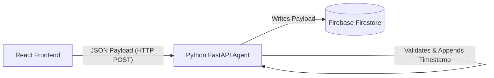

# Intentional Spending Tracker

**Kaggle Capstone Project**

## Overview
The Intentional Spending Tracker is a modern, full-stack web application designed to help users consciously track their financial flow. Instead of simply logging expenses passively, this tracker emphasizes *intent*—requiring users to categorize and describe their spending, and explicitly confirm their intent before submission.

## Architecture

This project is built using a decoupled architecture, separating the client interface from the processing middleware and the final database storage.

### 1. Frontend: React + Vite
The client-side application is a responsive, single-page application built with React and bundled via Vite.
- **Premium UI:** Uses glassmorphism, CSS modules, and smooth micro-animations to create an engaging experience.
- **Confirmation Step:** Acts as a psychological "speed bump." Before a record is sent, users are prompted via a modal to review their transaction, enforcing the concept of *intentionality*.
- **Tech Stack:** React, Vanilla CSS, Vite.

### 2. Middleware Agent: Python FastAPI
Instead of the frontend communicating directly with the database, all requests pass through a custom "Intentional Agent" middleware.
- **Role:** This acts as the authoritative gatekeeper. It receives the confirmed payload from the frontend.
- **Processing:** It validates the payload (e.g., ensuring amount > 0, valid categories), appends a trusted server-side UTC timestamp, and structures the final data.
- **Tech Stack:** Python 3, FastAPI, Pydantic (for strict data validation), Uvicorn.

### 3. Database: Firebase Firestore
The final destination for the tracked data is Google's Firebase Firestore (NoSQL Document Database).
- **Integration:** The Python middleware authenticates with Firebase (via `firebase-admin` SDK) and writes the processed payload as a new document in the `transactions` collection.
- **Configuration:** Scaffolded `firebase.json` and `.env` structures are included to demonstrate production-ready configuration management.

## Setup and Running Locally

### Prerequisites
- Node.js (v18+)
- Python (3.9+)

### Frontend
1. Navigate to the frontend directory: `cd frontend`
2. Install dependencies: `npm install`
3. Run the development server: `npm run dev`
4. Access at `http://localhost:5173`

### Python Agent Middleware
1. Navigate to the root directory.
2. Install dependencies: `pip install -r requirements.txt`
3. Run the Uvicorn server: `python agent.py`
4. The API will be available at `http://localhost:8000/api/track`

## Design Decisions
- **Why an intermediate Python Agent?** By placing a server-side agent between the frontend and Firebase, we ensure data integrity, allow for more complex validation rules, and establish a foundation for future machine learning integrations (e.g., spending anomaly detection) native to the Python ecosystem.
- **Why React + Vite?** Provides a blazingly fast development experience and produces highly optimized static assets suitable for free hosting on Firebase Hosting.
